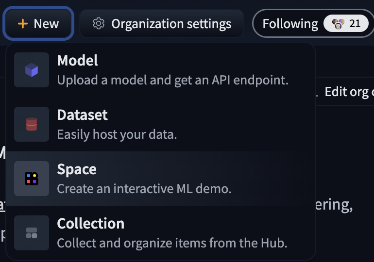
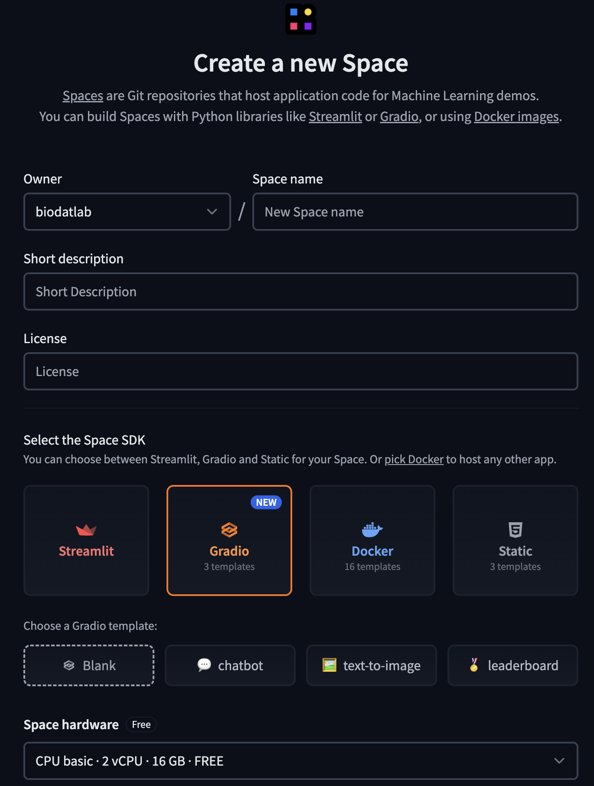

# Building ML Application with Gradio

## Running your first ML application on Gradio

First, open `Gradio_Examples.ipynb` on Colab as run all the examples.


## Hosting on Huggingface

If you want to host an application on Huggingface Spaces. There are a few more steps to put your Gradio application.

<p align="center">
  <br>
  <caption>
    Create a new space on Huggingface account
  </caption>
</p>

<p align="center">
  <br>
  <caption>
    Fill your information such as name, description, license, and the choose Space SDK to Gradio
  </caption>
</p>

`README.md` contains all the information about the Gradio application. 

- `sdk` is gradio
- `sdk_version` is Gradio version
- `app_file` is the location of your Gradio file (`app.py`)

```md
title: Thonburian Whisper
emoji: 🚀
colorFrom: pink
colorTo: blue
sdk: gradio
sdk_version: 5.9.1 # Gradio version
app_file: app.py # This is your Gradio file located
pinned: false
tags:
  - whisper-event
  - thai
  - transcription
duplicated_from: whisper-event/whisper-demo
license: apache-2.0
```

Then, you can put your `app.py` on the same directory. The rest is `requirements.txt` which should include all the libraries that is not Gradio such as `transformers`, `torch`, etc. `requirements.txt` looks something like the following:

```md
transformers
torch
```

You can see [Thonburian Whisper](https://huggingface.co/spaces/biodatlab/whisper-thai-demo/tree/main) as an example.